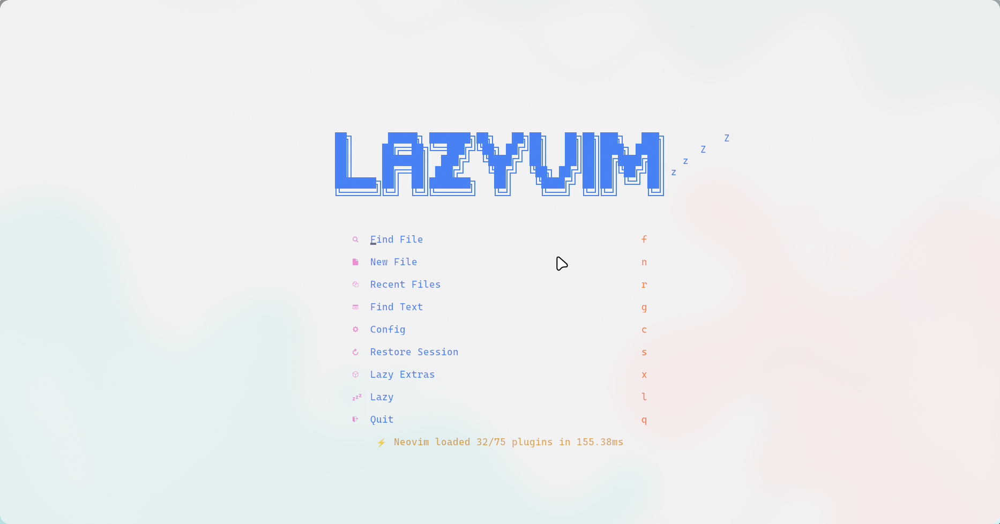
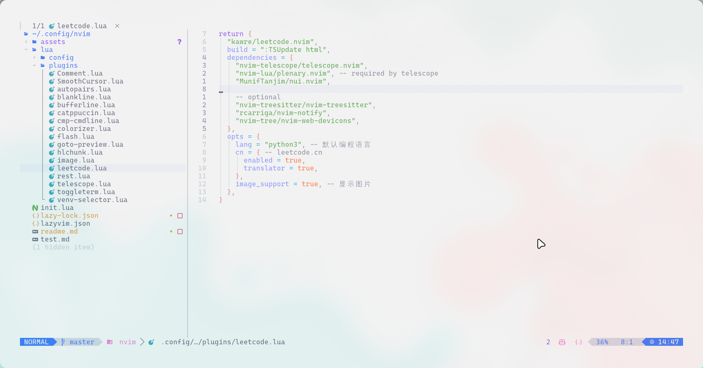
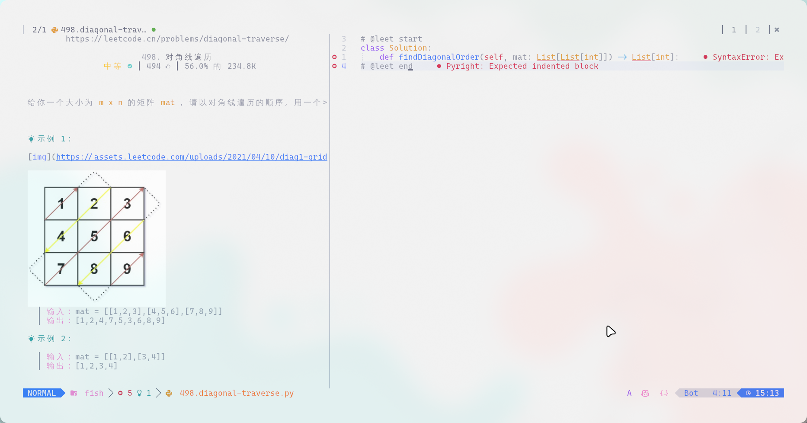

# neovim config

> 系统：archlinux
>
> 桌面：hyprland
>
> 终端：kitty
>
> 配置用于自用的，方便自己下次安装使用。但是不排除被人看到，因此还是提供一些说明，不建议直接使用(会浪费你的时间)！！！建议先找一些neovim配置教程(直接掀桌子,看neovim插件开发入门教程，哈哈)，并查看原插件作者的说明自行配置(都是这样一步步来的)，此外一些说明会在my_notes的笔记中。

##### 界面5








##### 说明

1. 上述完美适配kitty背景的效果可能来自主题的透明设置，也可能来自hyprland配置作者的一些设置(hyprland桌面使用脚本安装的)，之前其实不太适配，但是删除一次lazyvim的缓存之后就变成这样(` rm -rf ~/.local/share/nvim/lazy/* `)，目前没弄明白。

2. 若是自动选择虚拟环境后，anaconda的curl和系统的curl存在冲突：在`~/.zshrc`指定证书位置(位置或许不同，可以使用`sudo find / -name "ca-certificates.crt" `)：

   ```bash
   export CURL_CA_BUNDLE=/etc/ssl/certs/ca-certificates.crt
   ```

3. 安装`sudo pacman -S rg`，插件`telescope-live-grep-args.nvim`所需用于文件内容查找。

4. `:TSInstall http`用于`rest.nvim`插件编写`.http`

5. 安装`sudo pacman -S fd`，插件`venv-selector.nvim`所需

6. `sudo pacman -Syu imagemagick`,然后`paru -S luarocks` 和 `sudo luarocks --lua-version=5.1 install magick`,这里是`image.nvim`所需，用于在leetcode中显示图片。

7. 此外`lazyvim`一些自带的插件按需启用：

   ```tex
   Enabled Plugins:
       ● coding.codeium
       ● coding.copilot
       ● dap.core
       ● editor.outline
       ● editor.telescope
   
   Enabled Languages:
       ● lang.clangd
       ● lang.java 
       ● lang.markdown 
       ● lang.python 
       ● lang.sql
       ● lang.toml
       ● lang.typescript 
       ● lang.vue 
       ● lang.yaml 
   ```

   

