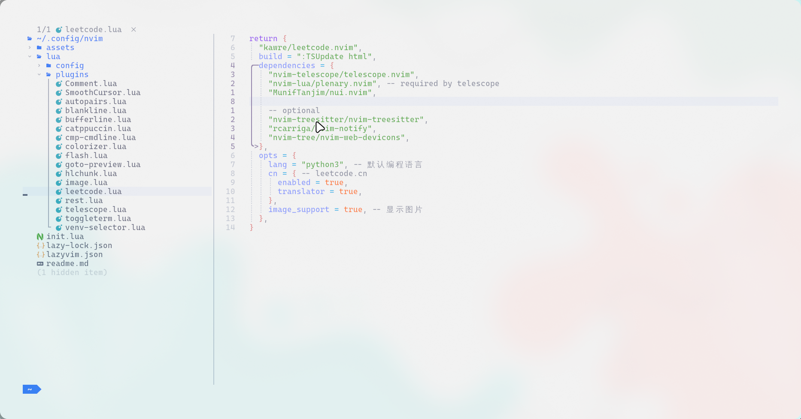

# neovim config

> 系统：archlinux
>
> 桌面：hyprland
>
> 终端：kitty
>
> 配置用于自用的，方便自己下次安装使用(~~服务器安装一个，然后平板使用termux远程连接，芜湖(服务器卡了,不建议啥都往服务器上装)~~)。但是不排除被人看到，因此还是提供一些说明，不建议直接使用(会浪费你的时间)！！！建议先找一些neovim配置教程(直接掀桌子,看neovim插件开发入门教程，哈哈)，并查看原插件作者的说明自行配置(都是这样一步步来的)，此外一些说明会在my_notes的笔记中。

##### 界面





##### 说明

1. 上述完美适配kitty背景的效果可能来自主题的透明设置，也可能来自hyprland配置作者的一些设置(hyprland桌面使用脚本安装的)，之前其实不太适配，但是删除一次lazy的缓存之后就变成这样(` rm -rf ~/.local/share/nvim/lazy/* `)，目前没弄明白。

2. 若是自动选择虚拟环境后，anaconda的curl和系统的curl存在冲突：在`~/.zshrc`指定证书位置(位置或许不同，可以使用`sudo find / -name "ca-certificates.crt" `)：

   ```bash
   export CURL_CA_BUNDLE=/etc/ssl/certs/ca-certificates.crt
   ```

3. 安装`sudo pacman -S rg`(`sudo apt install ripgrep`)，插件`telescope-live-grep-args.nvim`所需用于文件内容查找。

4. `:TSInstall http`用于`rest.nvim`插件编写`.http`

5. 安装`sudo pacman -S fd`，插件`venv-selector.nvim`所需。

   ```bash
   # ubuntu(略显复杂)
   sudo apt update
   sudo apt install fd-find
   mkdir -p ~/.local/bin
   sudo ln -s $(which fdfind) /usr/bin/fd
   ```

6. `sudo pacman -Syu imagemagick`(`sudo apt install imagemagick`),然后`paru -S luarocks`(`sudo apt-get install luarocks`) 和 `sudo luarocks --lua-version=5.1 install magick`,这里是`image.nvim`所需，用于在leetcode中显示图片。

   > 注：ubuntu中使用`sudo apt install imagemagick`安装的版本过低(6.x,不知道为啥),`sudo apt remove imagemagick`后自行编译：
   >
   > ```bash
   > sudo apt install imagemagick
   > 
   > # 更新源
   > sudo apt update
   > 
   > # 安装构建工具和依赖
   > sudo apt install build-essential libtool libjpeg-dev libpng-dev libtiff-dev libgif-dev
   > 
   > # 下载源文件
   > cd ~
   > git clone https://github.com/ImageMagick/ImageMagick.git
   > cd ImageMagick
   > git checkout 7.1.0-62  # 切换到稳定版本7.x
   > 
   > # 检查系统环境，生成编译 ImageMagick 所需的配置文件
   > ./configure
   > # 根据configure生成的配置文件编译ImageMagick的源代码
   > make
   > # 安装到系统目录中
   > sudo make install
   > 
   > magick --version
   > ```
   >

7. 其他依赖软件：

   1. `npm`和`nodejs` 

   2. `lazygit`

      ```bash
      LAZYGIT_VERSION=$(curl -s "https://api.github.com/repos/jesseduffield/lazygit/releases/latest" | grep -Po '"tag_name": "v\K[^"]*')
      curl -Lo lazygit.tar.gz "https://github.com/jesseduffield/lazygit/releases/latest/download/lazygit_${LAZYGIT_VERSION}_Linux_x86_64.tar.gz"
      tar xf lazygit.tar.gz lazygit
      sudo install lazygit /usr/local/bin
      
      lazygit --version
      ```

8. 此外`lazy.nvim`一些自带的插件按需启用：

   ```tex
   Enabled Plugins:
       ● coding.codeium
       ● coding.copilot
       ● dap.core
       ● editor.outline
       ● editor.telescope
   
   Enabled Languages:
       ● lang.clangd
       ● lang.java 
       ● lang.markdown 
       ● lang.python 
       ● lang.sql
       ● lang.toml
       ● lang.typescript 
       ● lang.vue 
       ● lang.yaml 
   ```

   


##### 快捷键

1. 在文件树中`H`显示隐藏文件。

2. 对于Copilot提示，不选择可以使用`Esc`退出插入模式，放弃当前的建议。或者`Ctrl + e`关闭当前的建议列表。

3. `Ctrl + o`：返回到之前的光标位置

4. LSP快捷键：使用`:map`查看快捷键，实际上不小心发现` ~/.local/share/nvim/lazy/LazyVim/lua/lazyvim/config/keymaps.lua`

   | 快捷键 | 作用                   |
   | ------ | ---------------------- |
   | gd     | 跳到变量的定义         |
   | gr     | 跳到引用               |
   | gI     | 跳转实现               |
   | gy     | 跳转类型定义           |
   | K      | 悬浮显示当前变量的信息 |

   ```lua
   # 一些快捷键的配置源码
   map("n", "<leader>cd", vim.diagnostic.open_float, { desc = "Line Diagnostics" })
   map("n", "]d", diagnostic_goto(true), { desc = "Next Diagnostic" })
   map("n", "[d", diagnostic_goto(false), { desc = "Prev Diagnostic" })
   map("n", "]e", diagnostic_goto(true, "ERROR"), { desc = "Next Error" })
   map("n", "[e", diagnostic_goto(false, "ERROR"), { desc = "Prev Error" })
   map("n", "]w", diagnostic_goto(true, "WARN"), { desc = "Next Warning" })
   map("n", "[w", diagnostic_goto(false, "WARN"), { desc = "Prev Warning" })
   ```
   
   
